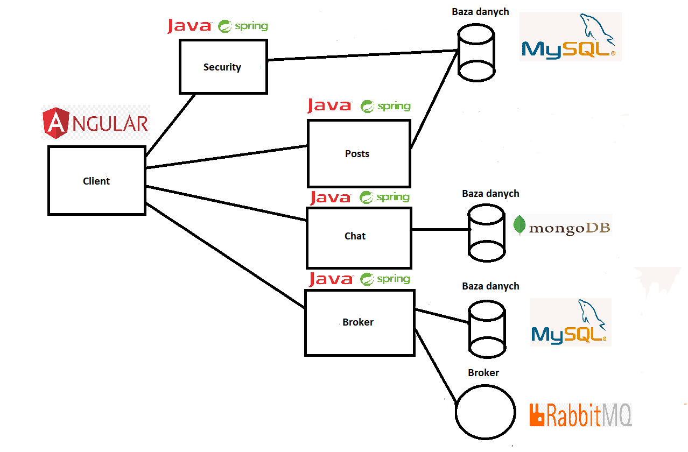

# Serwis Spolecznosciowy - API
Serwis społecznościowy API to projekt części serwerowej serwisu społecznościowego napisanego za pomocą Javy i frameworka Spring boot. Jest on połączony z aplikacją kliencką
napisaną za pomocą frameworka Angular.

## Budowa systemu 

Część serwerowa projektu jest podzielona na cztery aplikacje z których każda odpowiada za część usług oferowanych przez system.

- Posts
- Chat
- Broker
- Security

Każda z nich jest połączona z odpowiadającą jej bazą danych SQL/NOSQL, a dodatkowo 'broker' łączy się z brokerem wiadomości RabbitMQ. Cały system został skonteneryzowany
za pomocą narzędzia docker-compose, a kod aplikacji został umieszczony na chmurze Microsoft Azure

## Opis systemu 

### Posts
Aplikacja 'Posts' umożliwia użytkownikom wyświetlanie i dodawanie wpisów, komentowanie ich i reagowanie na nie.
Dodatkowo pozwala ona na obserwowanie i blokowanie użytkowników, a także na wyświetlanie wpisów zgodnie z wybranymi kryteriami (wpisy obserwowanych użytkowników, 
polubione wpisy, wpisy danego użytkownika itd.). Aplikacja jest połączona z bazą danych MySQL, przechowując w niej wpisy, reakcje, komentarze,
a także relacje z innymi użytkownikami

### Chat
Aby umożliwić użytkownikom komunikację ze sobą w czasie rzeczywistym stworzono aplikację pełniącą role komunikatora pozwalającego użytkownikom na pisanie 
do siebie wiadomości tekstowych. Aplikacja ta jest połączona z bazą danych MongoDB przechowującą wiadomości wymieniane z innymi użytkownikami.

### Broker
Apliakcja wysyłająca powiadomienia do użytkowników do których została napisana wiadomość lub których
wpis został skomentowany albo polubiony. Aplikacja jest połączona z brokerem wiadomości RabbitMQ za pomocą którego rozsyła powiadomienia pomiędzy użytkownikami, 
dodatkowo jest połączona z bazą danych MySQL w której zapisuje powiadomienia użytkowników.

### Security
Aplikacja 'Security' jest odpowiedzialna za autentykacje i autoryzacje użytkowników. Pozwala ona użytkownikom na zalogowanie się i zarejestrowanie 
swojego konta. Po udanym logowaniu zwraca token JWT za pomocą którego użytkownik dokonuje autoryzacji w innych aplikacjach. 
Aplikacja jest połączona z bazą danych MySQL w której zapisane są informacje o użytkownikach.
